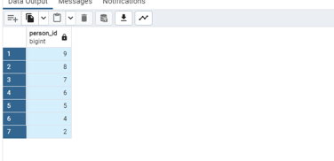
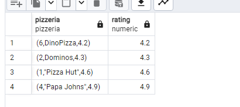
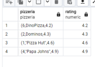
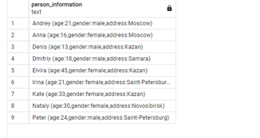
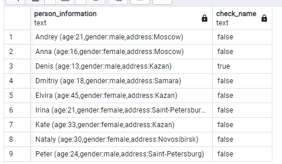
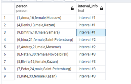

## Day 00

#### Exercise 00 - First steps into SQL world


```sql
SELECT * FROM person WHERE address = 'Kazan' 
```


#### Exercise 01 - First steps into SQL world


```sql
SELECT * FROM person WHERE address='Kazan' AND gender='female'
ORDER BY name
```


#### Exercise 02 - First steps into SQL world
\

```sql
SELECT * FROM pizzeria WHERE rating>=3.5 AND rating<=5
ORDER BY rating
```



#### Exercise 03: First steps into SQL


```sql
SELECT * FROM person_visits WHERE visit_date BETWEEN '2022-01-06' AND '2022-01-09' AND pizzeria_id=2
ORDER BY person_id desc
```


#### Exercise 04 - First steps into SQL world


```sql
SELECT concat('age:',age,',gender:',gender,',address:',address) AS person_information
FROM person 
```


#### Exercise 05 - First steps into SQL world


```sql
SELECT name
FROM person
WHERE id IN
	(SELECT person_id FROM person_order
	WHERE order_date = '2022-01-07' AND menu_id IN(13,14,18)
)
```



#### Exercise 06 - First steps into SQL world


```sql
SELECT 
    name,
    CASE 
        WHEN EXISTS (
            SELECT 1 
            FROM person_order 
            WHERE person_order.person_id = person.id 
            AND menu_id IN (13, 14, 18) 
            AND order_date = '2022-01-07'
        ) THEN 'Has Order'
        ELSE 'No Order'
    END AS check_name
FROM 
    person 
```


#### Exercise 07 - First steps into SQL world


```sql
SELECT  
    id, 
    name, 
    age, 
    CASE  
        WHEN age >= 10 AND age <= 20 THEN 'interval #1' 
        WHEN age > 20 AND age < 24 THEN 'interval #2' 
        ELSE 'interval #3' 
    END AS interval_info 
FROM person 
ORDER BY interval_info ASC;
```



#### Exercise 08 - First steps into SQL world


```sql
SELECT  *
FROM person_order
WHERE id % 2 = 0
ORDER BY id;
```



#### Exercise 09 - First steps into SQL world


```sql
SELECT (SELECT name FROM person WHERE person.id = pv.person_id) AS person_name, 
       (SELECT name FROM pizzeria WHERE pizzeria.id = pv.pizzeria_id) AS pizzeria_name 
FROM (SELECT person_id, pizzeria_id  
      FROM person_visits  
      WHERE visit_date BETWEEN '2022-01-07' AND '2022-01-09') AS pv 
ORDER BY person_name ASC, pizzeria_name DESC;
```
